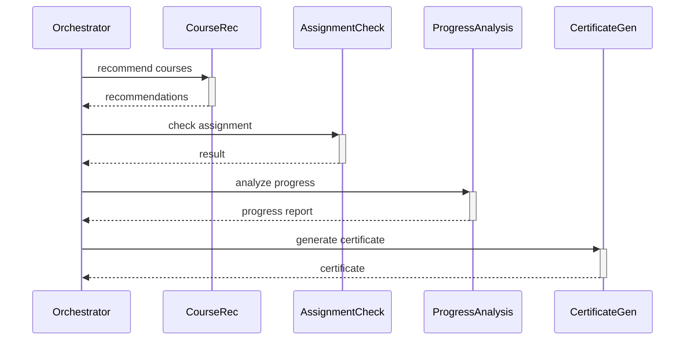

# Лабораторная работа №13 — Мультиагентные системы

**Вариант 23:** Система e-learning (Повышенный)

## Агенты

| Агент | Роль | Вход | Выход |
|-------|------|------|-------|
| **Course Recommendation** | Рекомендует курсы на основе профиля и истории | UserID, профиль, история | Список рекомендованных курсов |
| **Assignment Check** | Проверяет задания (тесты, код) | AssignmentID, ответ студента | Результат проверки (passed/failed, баллы) |
| **Progress Analysis** | Анализирует прогресс студента | UserID, данные о прохождении | Статистика, отставания, рекомендации |
| **Certificate Generation** | Генерирует сертификаты | UserID, CourseID, результат | PDF-сертификат (ссылка) |

## Список заданий (повышенный уровень)

1. Разработка полной системы из 3–5 агентов на Go ← **текущее**
2. Цепочки задач (pipeline)
3. Распределённая трассировка (Jaeger + OpenTelemetry)
4. Агент с состоянием (Redis)
5. Динамическое масштабирование
6. Аукционное распределение задач
7. Интеграция LLM-агента (Ollama)
8. Веб-интерфейс для мониторинга

---

## Задание 1: Разработка полной системы из 3–5 агентов на Go

### План

1. **Структура проекта** — монорепозиторий:
   ```
   ├── agents/
   │   ├── course-recommendation/   # Go-агент рекомендаций
   │   ├── assignment-check/        # Go-агент проверки заданий
   │   ├── progress-analysis/       # Go-агент анализа прогресса
   │   └── certificate-gen/         # Go-агент генерации сертификатов
   ├── orchestrator/                # Python-оркестратор
   ├── docker-compose.yml           # NATS + Redis + Jaeger
   ├── PROMPT_LOG.md
   └── README.md
   ```

2. **Общие типы данных (Go)** — пакет `shared` или `types` с JSON-структурами:
   - `Task` — задание от оркестратора (ID, тип, полезная нагрузка)
   - `Result` — результат от агента (TaskID, Success, Output, Error)

3. **Каналы NATS**:
   - `tasks.course.recommend` → `tasks.course.recommended`
   - `tasks.assignment.check` → `tasks.assignment.checked`
   - `tasks.progress.analyze` → `tasks.progress.analyzed`
   - `tasks.certificate.generate` → `tasks.certificate.generated`
   - `tasks.completed` — общий канал результатов

4. **Реализация каждого агента**:
   - Подписка на свой входящий канал
   - Бизнес-логика (симулированная или реальная)
   - Публикация результата в исходящий канал
   - Graceful shutdown

5. **docker-compose.yml** — NATS как брокер сообщений

### Структура Go-агента (шаблон)

```go
package main

import (
    "encoding/json"
    "log"
    "github.com/nats-io/nats.go"
)

type Task struct {
    ID      string `json:"id"`
    Type    string `json:"type"`
    Payload string `json:"payload"`
}

type Result struct {
    TaskID  string `json:"task_id"`
    Success bool   `json:"success"`
    Output  string `json:"output"`
}

func main() {
    nc, _ := nats.Connect(nats.DefaultURL)
    defer nc.Close()

    nc.Subscribe("tasks.<agent_type>", func(m *nats.Msg) {
        var task Task
        json.Unmarshal(m.Data, &task)
        // обработка
        result := processTask(task)
        response, _ := json.Marshal(result)
        nc.Publish("tasks.completed", response)
    })

    select {}
}
```

### Детальная реализация агентов

---

#### 1. Course Recommendation Agent

**Назначение:** Рекомендует пользователю подходящие курсы на основе его профиля и истории обучения.

**Входные данные (Payload):**
```json
{
  "user_id": "u-001",
  "profile": {
    "interests": ["python", "machine learning", "data science"],
    "skill_level": "intermediate",
    "preferred_lang": "ru"
  },
  "history": [
    {"course_id": "c-001", "title": "Python Basics", "completed": true, "score": 85},
    {"course_id": "c-002", "title": "SQL Fundamentals", "completed": false, "score": 0}
  ]
}
```

**Бизнес-логика:**
1. Загружает внутренний каталог курсов (hardcoded в агента)
2. Фильтрует уже пройденные курсы
3. Для каждого курса вычисляет **score релевантности** по формуле:
   - Совпадение интересов (interests ∩ course_tags) → +40 баллов
   - Соответствие skill_level → +30 баллов
   - Популярность (рейтинг) → +20 баллов
   - Наличие новых материалов → +10 баллов
4. Сортирует по убыванию score, возвращает топ-5

**Выходные данные:**
```json
{
  "task_id": "t-001",
  "success": true,
  "output": {
    "user_id": "u-001",
    "recommendations": [
      {"course_id": "c-005", "title": "ML with Python", "score": 92, "reason": "Совпадает с вашими интересами"},
      {"course_id": "c-008", "title": "Advanced Python", "score": 78, "reason": "Подходит вашему уровню"}
    ]
  }
}
```

---

#### 2. Assignment Check Agent

**Назначение:** Проверяет выполненные задания студентов и выставляет оценку.

**Входные данные (Payload):**
```json
{
  "assignment_id": "a-042",
  "user_id": "u-001",
  "course_id": "c-005",
  "assignment_type": "test",
  "answer": {
    "choices": ["b", "c", "a", "d", "b"],
    "code": "",
    "essay": ""
  }
}
```

**Поддерживаемые типы заданий и логика:**
- **test** — сравнивает ответы с answer_key (внутренний), считает кол-во правильных, вычисляет процент
- **code** — симулирует запуск тест-кейсов (рандомный % прохождения, но с привязкой к сложности)
- **essay** — проверяет длину (>100 символов), наличие ключевых слов из `assignment_keywords`, возвращает скоринг

**Бизнес-правила:**
- score ≥ 80% → passed
- score ≥ 50% → retry allowed
- score < 50% → failed, нужна пересдача
- max 3 попытки на одно задание

**Выходные данные:**
```json
{
  "task_id": "t-002",
  "success": true,
  "output": {
    "assignment_id": "a-042",
    "user_id": "u-001",
    "passed": true,
    "score": 85,
    "max_score": 100,
    "feedback": "Верно: 4/5. Ошибка в вопросе 3 — правильный ответ 'd'",
    "checked_at": "2026-05-22T10:00:00Z"
  }
}
```

---

#### 3. Progress Analysis Agent

**Назначение:** Анализирует прогресс студента по курсу, выявляет отставания и даёт рекомендации.

**Входные данные (Payload):**
```json
{
  "user_id": "u-001",
  "course_id": "c-005",
  "activity_log": [
    {"date": "2026-05-01", "type": "lesson", "title": "Intro", "completed": true},
    {"date": "2026-05-03", "type": "assignment", "title": "HW1", "score": 90, "completed": true},
    {"date": "2026-05-10", "type": "assignment", "title": "HW2", "score": 45, "completed": true},
    {"date": "2026-05-15", "type": "lesson", "title": "Advanced Topics", "completed": false}
  ]
}
```

**Бизнес-логика:**
1. **Completion %** = completed / total × 100
2. **Средний балл** = среднее по assignment score
3. **Тренд** — сравнивает последние 3 задания:
   - Если каждый следующий score ≥ предыдущий → "improving"
   - Если каждый следующий score ≤ предыдущий → "declining"
   - Иначе → "stable"
4. **Weak topics** — задания со score < 60% отмечает как проблемные
5. **Рекомендации** — на основе weak topics предлагает перепройти материалы

**Выходные данные:**
```json
{
  "task_id": "t-003",
  "success": true,
  "output": {
    "user_id": "u-001",
    "course_id": "c-005",
    "completion_pct": 50.0,
    "avg_score": 67.5,
    "trend": "declining",
    "weak_topics": [{"title": "HW2", "score": 45, "suggestion": "Повторить тему Advanced Topics"}],
    "recommendations": ["Пройдите урок Advanced Topics", "Повторите материалы перед HW3"]
  }
}
```

---

#### 4. Certificate Generation Agent

**Назначение:** Генерирует сертификаты о завершении курса (симулирует создание PDF).

**Входные данные (Payload):**
```json
{
  "user_id": "u-001",
  "user_name": "Иван Иванов",
  "course_id": "c-005",
  "course_name": "ML with Python",
  "completion_date": "2026-05-20",
  "grade": "A",
  "credits": 5,
  "requirements_met": true
}
```

**Бизнес-логика:**
1. Валидация — проверяет `requirements_met`
2. Генерирует уникальный `certificate_id` (UUID)
3. Создаёт запись сертификата (в реальной системе — PDF, здесь — структура данных)
4. Устанавливает срок действия (обычно бессрочный, или +3 года)
5. Возвращает метаданные сертификата

**Бизнес-правила:**
- Сертификат выдаётся только при requirements_met = true
- grade рассчитывается по среднему баллу: ≥90 → A, ≥75 → B, ≥60 → C
- certificate_url — симулированный путь `/certificates/{id}.pdf`

**Выходные данные:**
```json
{
  "task_id": "t-004",
  "success": true,
  "output": {
    "certificate_id": "cert-uuuid-xxx",
    "user_id": "u-001",
    "user_name": "Иван Иванов",
    "course_id": "c-005",
    "course_name": "ML with Python",
    "grade": "A",
    "issued_at": "2026-05-22T10:00:00Z",
    "valid_until": "2029-05-22T10:00:00Z",
    "certificate_url": "/certificates/cert-uuuid-xxx.pdf"
  }
}
```

---

### Pipeline (цепочка агентов для Задания 2)



---

### Шаги реализации

- [ ] 1.1. Инициализировать Go-модули для всех 4 агентов
- [ ] 1.2. Реализовать агента **Course Recommendation**
- [ ] 1.3. Реализовать агента **Assignment Check**
- [ ] 1.4. Реализовать агента **Progress Analysis**
- [ ] 1.5. Реализовать агента **Certificate Generation**
- [ ] 1.6. Написать оркестратор на Python (nats-py + asyncio)
- [ ] 1.7. Создать docker-compose.yml c NATS
- [ ] 1.8. Протестировать взаимодействие всех компонентов
