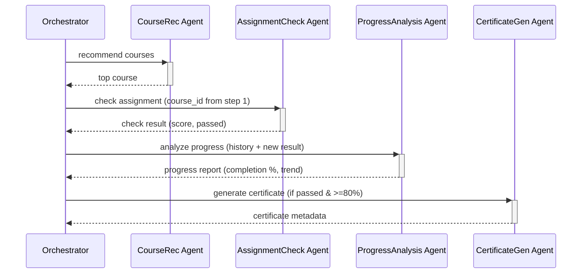

# Лабораторная работа №13 — Мультиагентные системы

**Вариант 23:** Система e-learning (Повышенный)

## Быстрый старт

```bash
# 1. Запустить NATS + Redis + Jaeger
docker compose up -d nats redis jaeger

# 2. Запустить 3 Go-агента (кроме assignment-check — он в K8s)
cd agents/course-recommendation && go run . &
cd agents/progress-analysis && go run . &
cd agents/certificate-gen && go run . &

# 3. Запустить assignment-checker в Kubernetes (kind)
kind create cluster --name laba13
kubectl apply -f k8s/deployment.yaml
kubectl apply -f k8s/hpa.yaml

# 4. Запустить оркестратор (тесты + pipeline)
cd orchestrator && source venv/bin/activate && python3 orchestrator.py

# 5. Остановить
docker compose down
kind delete cluster --name laba13
```

## Агенты

| Агент | Роль | Вход | Выход |
|-------|------|------|-------|
| **Course Recommendation** | Рекомендует курсы на основе профиля и истории | UserID, профиль, история | Список рекомендованных курсов |
| **Assignment Check** | Проверяет задания (тесты, код) | AssignmentID, ответ студента | Результат проверки (passed/failed, баллы) |
| **Progress Analysis** | Анализирует прогресс студента | UserID, данные о прохождении | Статистика, отставания, рекомендации |
| **Certificate Generation** | Генерирует сертификаты | UserID, CourseID, результат | PDF-сертификат (ссылка) |

## Список заданий (повышенный уровень)

1. Разработка полной системы из 3–5 агентов на Go ✅
2. Цепочки задач (pipeline) ✅
3. Распределённая трассировка (Jaeger + OpenTelemetry) ✅
4. Агент с состоянием (Redis) ✅
5. Динамическое масштабирование ✅
6. Аукционное распределение задач ✅
7. Интеграция LLM-агента (Ollama) ✅
8. Веб-интерфейс для мониторинга ✅

---

## Задание 1: Разработка полной системы из 3–5 агентов на Go

### План

1. **Структура проекта** — монорепозиторий:
   ```
   ├── agents/
   │   ├── course-recommendation/   # Go-агент рекомендаций
   │   ├── assignment-check/        # Go-агент проверки заданий
   │   ├── progress-analysis/       # Go-агент анализа прогресса
   │   └── certificate-gen/         # Go-агент генерации сертификатов
   ├── orchestrator/                # Python-оркестратор
   ├── docker-compose.yml           # NATS + Redis + Jaeger
   ├── PROMPT_LOG.md
   └── README.md
   ```

2. **Общие типы данных (Go)** — пакет `shared` или `types` с JSON-структурами:
   - `Task` — задание от оркестратора (ID, тип, полезная нагрузка)
   - `Result` — результат от агента (TaskID, Success, Output, Error)

3. **Каналы NATS**:
   - `tasks.course.recommend` → `tasks.course.recommended`
   - `tasks.assignment.check` → `tasks.assignment.checked`
   - `tasks.progress.analyze` → `tasks.progress.analyzed`
   - `tasks.certificate.generate` → `tasks.certificate.generated`
   - `tasks.completed` — общий канал результатов

4. **Реализация каждого агента**:
   - Подписка на свой входящий канал
   - Бизнес-логика (симулированная или реальная)
   - Публикация результата в исходящий канал
   - Graceful shutdown

5. **docker-compose.yml** — NATS как брокер сообщений

### Структура Go-агента (шаблон)

```go
package main

import (
    "encoding/json"
    "log"
    "github.com/nats-io/nats.go"
)

type Task struct {
    ID      string `json:"id"`
    Type    string `json:"type"`
    Payload string `json:"payload"`
}

type Result struct {
    TaskID  string `json:"task_id"`
    Success bool   `json:"success"`
    Output  string `json:"output"`
}

func main() {
    nc, _ := nats.Connect(nats.DefaultURL)
    defer nc.Close()

    nc.Subscribe("tasks.<agent_type>", func(m *nats.Msg) {
        var task Task
        json.Unmarshal(m.Data, &task)
        // обработка
        result := processTask(task)
        response, _ := json.Marshal(result)
        nc.Publish("tasks.completed", response)
    })

    select {}
}
```

### Детальная реализация агентов

---

#### 1. Course Recommendation Agent

**Назначение:** Рекомендует пользователю подходящие курсы на основе его профиля и истории обучения.

**Входные данные (Payload):**
```json
{
  "user_id": "u-001",
  "profile": {
    "interests": ["python", "machine learning", "data science"],
    "skill_level": "intermediate",
    "preferred_lang": "ru"
  },
  "history": [
    {"course_id": "c-001", "title": "Python Basics", "completed": true, "score": 85},
    {"course_id": "c-002", "title": "SQL Fundamentals", "completed": false, "score": 0}
  ]
}
```

**Бизнес-логика:**
1. Загружает внутренний каталог курсов (hardcoded в агента)
2. Фильтрует уже пройденные курсы
3. Для каждого курса вычисляет **score релевантности** по формуле:
   - Совпадение интересов (interests ∩ course_tags) → +40 баллов
   - Соответствие skill_level → +30 баллов
   - Популярность (рейтинг) → +20 баллов
   - Наличие новых материалов → +10 баллов
4. Сортирует по убыванию score, возвращает топ-5

**Выходные данные:**
```json
{
  "task_id": "t-001",
  "success": true,
  "output": {
    "user_id": "u-001",
    "recommendations": [
      {"course_id": "c-005", "title": "ML with Python", "score": 92, "reason": "Совпадает с вашими интересами"},
      {"course_id": "c-008", "title": "Advanced Python", "score": 78, "reason": "Подходит вашему уровню"}
    ]
  }
}
```

---

#### 2. Assignment Check Agent

**Назначение:** Проверяет выполненные задания студентов и выставляет оценку.

**Входные данные (Payload):**
```json
{
  "assignment_id": "a-042",
  "user_id": "u-001",
  "course_id": "c-005",
  "assignment_type": "test",
  "answer": {
    "choices": ["b", "c", "a", "d", "b"],
    "code": "",
    "essay": ""
  }
}
```

**Поддерживаемые типы заданий и логика:**
- **test** — сравнивает ответы с answer_key (внутренний), считает кол-во правильных, вычисляет процент
- **code** — симулирует запуск тест-кейсов (рандомный % прохождения, но с привязкой к сложности)
- **essay** — проверяет длину (>100 символов), наличие ключевых слов из `assignment_keywords`, возвращает скоринг

**Бизнес-правила:**
- score ≥ 80% → passed
- score ≥ 50% → retry allowed
- score < 50% → failed, нужна пересдача
- max 3 попытки на одно задание

**Выходные данные:**
```json
{
  "task_id": "t-002",
  "success": true,
  "output": {
    "assignment_id": "a-042",
    "user_id": "u-001",
    "passed": true,
    "score": 85,
    "max_score": 100,
    "feedback": "Верно: 4/5. Ошибка в вопросе 3 — правильный ответ 'd'",
    "checked_at": "2026-05-22T10:00:00Z"
  }
}
```

---

#### 3. Progress Analysis Agent

**Назначение:** Анализирует прогресс студента по курсу, выявляет отставания и даёт рекомендации.

**Входные данные (Payload):**
```json
{
  "user_id": "u-001",
  "course_id": "c-005",
  "activity_log": [
    {"date": "2026-05-01", "type": "lesson", "title": "Intro", "completed": true},
    {"date": "2026-05-03", "type": "assignment", "title": "HW1", "score": 90, "completed": true},
    {"date": "2026-05-10", "type": "assignment", "title": "HW2", "score": 45, "completed": true},
    {"date": "2026-05-15", "type": "lesson", "title": "Advanced Topics", "completed": false}
  ]
}
```

**Бизнес-логика:**
1. **Completion %** = completed / total × 100
2. **Средний балл** = среднее по assignment score
3. **Тренд** — сравнивает последние 3 задания:
   - Если каждый следующий score ≥ предыдущий → "improving"
   - Если каждый следующий score ≤ предыдущий → "declining"
   - Иначе → "stable"
4. **Weak topics** — задания со score < 60% отмечает как проблемные
5. **Рекомендации** — на основе weak topics предлагает перепройти материалы

**Выходные данные:**
```json
{
  "task_id": "t-003",
  "success": true,
  "output": {
    "user_id": "u-001",
    "course_id": "c-005",
    "completion_pct": 50.0,
    "avg_score": 67.5,
    "trend": "declining",
    "weak_topics": [{"title": "HW2", "score": 45, "suggestion": "Повторить тему Advanced Topics"}],
    "recommendations": ["Пройдите урок Advanced Topics", "Повторите материалы перед HW3"]
  }
}
```

---

#### 4. Certificate Generation Agent

**Назначение:** Генерирует сертификаты о завершении курса (симулирует создание PDF).

**Входные данные (Payload):**
```json
{
  "user_id": "u-001",
  "user_name": "Иван Иванов",
  "course_id": "c-005",
  "course_name": "ML with Python",
  "completion_date": "2026-05-20",
  "grade": "A",
  "credits": 5,
  "requirements_met": true
}
```

**Бизнес-логика:**
1. Валидация — проверяет `requirements_met`
2. Генерирует уникальный `certificate_id` (UUID)
3. Создаёт запись сертификата (в реальной системе — PDF, здесь — структура данных)
4. Устанавливает срок действия (обычно бессрочный, или +3 года)
5. Возвращает метаданные сертификата

**Бизнес-правила:**
- Сертификат выдаётся только при requirements_met = true
- grade рассчитывается по среднему баллу: ≥90 → A, ≥75 → B, ≥60 → C
- certificate_url — симулированный путь `/certificates/{id}.pdf`

**Выходные данные:**
```json
{
  "task_id": "t-004",
  "success": true,
  "output": {
    "certificate_id": "cert-uuuid-xxx",
    "user_id": "u-001",
    "user_name": "Иван Иванов",
    "course_id": "c-005",
    "course_name": "ML with Python",
    "grade": "A",
    "issued_at": "2026-05-22T10:00:00Z",
    "valid_until": "2029-05-22T10:00:00Z",
    "certificate_url": "/certificates/cert-uuuid-xxx.pdf"
  }
}
```

---

## Задание 2: Цепочка задач (Pipeline)

### Описание

Реализована последовательная обработка задачи через всех 4 агентов. Оркестратор управляет цепочкой: результат каждого шага передаётся на вход следующему.

### Pipeline Flow



### Детали реализации (в `orchestrator.py:run_pipeline()`)

| Шаг | Агент | Вход (откуда данные) | Выход (куда дальше) |
|-----|-------|---------------------|-------------------|
| 1 | CourseRec | user profile + history из запроса | top_course (course_id, title, score) |
| 2 | AssignmentCheck | assignment_id из запроса + course_id из шага 1 | check_result (passed, score, feedback) |
| 3 | ProgressAnalysis | activity_log из запроса + дополненный результатом шага 2 | progress (completion_pct, avg_score, trend) |
| 4 | CertificateGen | user_name, course_name из шага 1, grade из шага 2 | certificate (certificate_id, URL, valid_until) |

### Pipeline ID

Каждый pipeline получает уникальный `pipeline_id` (UUID), который логируется на всех шагах для сквозной трассировки.

---

### Прогресс выполнения

**Задание 1 — выполнено:**
- [x] 1.1. Инициализировать Go-модули для всех 4 агентов
- [x] 1.2. Реализовать агента **Course Recommendation**
- [x] 1.3. Реализовать агента **Assignment Check**
- [x] 1.4. Реализовать агента **Progress Analysis**
- [x] 1.5. Реализовать агента **Certificate Generation**
- [x] 1.6. Написать оркестратор на Python (nats-py + asyncio)
- [x] 1.7. Создать docker-compose.yml c NATS
- [x] 1.8. Протестировать взаимодействие всех компонентов

### Как запустить (Задание 1)

```bash
# 1. NATS
docker run -d --name nats -p 4222:4222 nats:latest

# 2. Агенты (4 терминала или фон)
cd agents/course-recommendation && go run . &
cd agents/assignment-check && go run . &
cd agents/progress-analysis && go run . &
cd agents/certificate-gen && go run . &

# 3. Оркестратор (индивидуальные тесты)
cd orchestrator && source venv/bin/activate && python3 orchestrator.py

# 4. Очистка
docker stop nats && docker rm nats
```

---

## Задание 3: Распределённая трассировка (Jaeger + OpenTelemetry)

### Что сделано

Добавлена распределённая трассировка через OpenTelemetry (OTLP) с визуализацией в Jaeger. Теперь каждый вызов агента порождает цепочку spans, которая видна в Jaeger UI как единый трейс.

---

### 1. `shared/otel.go` — ядро трассировки для Go-агентов

#### `InitTracer(serviceName string) (*sdktrace.TracerProvider, error)`

Создаёт и настраивает TracerProvider для каждого Go-агента:

1. Читает переменную окружения `OTEL_EXPORTER_OTLP_ENDPOINT` (по умолчанию `http://localhost:4318`)
2. Создаёт **OTLP HTTP exporter** — отправляет spans на Jaeger Collector по протоколу OTLP
3. Создаёт **Resource** с метаданными сервиса:
   - `service.name` — имя агента (course-recommendation, assignment-check и т.д.)
   - `service.version` — "1.0.0"
   - `service.group` — "e-learning"
4. Создаёт **TracerProvider** с:
   - `BatchSpanProcessor` — экспорт spans пачками (не блокирует обработку)
   - `AlwaysSample()` — семплинг 100% (для лабораторной)
5. Устанавливает глобальный TracerProvider: `otel.SetTracerProvider(tp)`
6. Устанавливает **TextMapPropagator** — W3C TraceContext + Baggage для передачи trace_id между сервисами через NATS headers
7. Возвращает TracerProvider для последующего Shutdown

#### `ShutdownTracer(tp *sdktrace.TracerProvider)`

Завершает работу трейсера:

1. Создаёт контекст с таймаутом 5 секунд
2. Вызывает `tp.Shutdown(ctx)` — **flushet все оставшиеся spans** перед выходом
3. Логирует ошибку, если shutdown не удался

Вызывается в `defer` в каждом агенте: гарантирует, что ни один span не потеряется.

#### `InjectTraceContext(ctx context.Context) map[string]string`

**Инъекция** trace context в map для NATS headers:

1. Создаёт `TraceCarrier` (реализует `TextMapCarrier` через `map[string]string`)
2. Вызывает `otel.GetTextMapPropagator().Inject(ctx, carrier)` — записывает W3C `traceparent` в carrier
3. Возвращает map для установки в NATS message headers

Используется в агентах при отправке результата: каждый Go-агент при публикации ответа в `tasks.completed` проставляет `traceparent` header, чтобы оркестратор мог связать ответ с исходным запросом.

#### `ExtractTraceContext(ctx context.Context, headers map[string]string) context.Context`

**Извлечение** trace context из NATS headers:

1. Создаёт `TraceCarrier` из полученных headers
2. Вызывает `otel.GetTextMapPropagator().Extract(ctx, carrier)` — читает `traceparent`, восстанавливает span context
3. Возвращает контекст с parent span'ом

Используется в агентах при получении задачи: если входящее NATS-сообщение содержит `traceparent`, агент создаёт дочерний span от родительского, тем самым выстраивая единую цепочку вызовов.

---

### 2. Go-агенты — spans с атрибутами

Каждый агент обёртывает обработку задачи в span. Пример (course-recommendation):

```go
// Извлечение trace context из заголовков NATS-сообщения
headers := make(map[string]string)
for k, v := range m.Header {
    if len(v) > 0 {
        headers[k] = v[0]
    }
}
ctx := shared.ExtractTraceContext(context.Background(), headers)

// Создание дочернего span
ctx, span := shared.Tracer.Start(ctx, "course-recommendation.process",
    trace.WithAttributes(
        attribute.String("messaging.system", "nats"),
        attribute.String("messaging.destination", m.Subject),
    ),
)
defer span.End()

// Добавление атрибутов по ходу обработки
span.SetAttributes(
    attribute.String("task.id", task.ID),
    attribute.String("user.id", req.UserID),
)

// После обработки — результат
span.SetAttributes(
    attribute.Int("recommendations.count", len(output.Recommendations)),
    attribute.String("top.course", output.Recommendations[0].Title),
    attribute.Int("top.score", output.Recommendations[0].Score),
)

// Инъекция trace context в ответное сообщение
msg := nats.NewMsg("tasks.completed")
for k, v := range shared.InjectTraceContext(ctx) {
    msg.Header.Set(k, v)
}
nc.PublishMsg(msg)
```

**Атрибуты spans по агентам:**

| Агент | Атрибуты |
|-------|----------|
| **CourseRec** | `task.id`, `user.id`, `recommendations.count`, `top.course`, `top.score` |
| **AssignmentCheck** | `task.id`, `assignment.id`, `assignment.type`, `user.id`, `assignment.passed`, `assignment.score`, `assignment.max_score` |
| **ProgressAnalysis** | `task.id`, `user.id`, `course.id`, `activity.entries`, `progress.completion_pct`, `progress.avg_score`, `progress.trend`, `progress.weak_topics` |
| **CertificateGen** | `task.id`, `user.id`, `user.name`, `course.id`, `course.name`, `requirements_met`, `certificate.issued`, `certificate.id`, `certificate.grade` |

---

### 3. `orchestrator/tracer.py` — трассировка Python-оркестратора

Функция `init_tracer()`:

1. Читает `OTEL_EXPORTER_OTLP_ENDPOINT` (по умолчанию `http://localhost:4318`)
2. Создаёт Resource с `service.name: "orchestrator"`
3. Создаёт `OTLPSpanExporter` с endpoint `/v1/traces`
4. Создаёт `TracerProvider` + `BatchSpanProcessor`
5. Устанавливает глобальный провайдер через `trace.set_tracer_provider(provider)`
6. Возвращает `tracer` для создания spans

---

### 4. `orchestrator/orchestrator.py` — spans в pipeline

**`send_task()`** — теперь принимает `parent_ctx` и `step_name`:

```python
async def send_task(self, subject, payload, timeout=30,
                    parent_ctx=None, step_name=""):
    with self.tracer.start_as_current_span(
        span_name, context=parent_ctx,
        kind=SpanKind.PRODUCER,
    ) as span:
        span.set_attribute("task.id", task_id)
        span.set_attribute("messaging.destination", subject)

        # Инъекция trace context в NATS headers
        headers = {}
        inject(headers)  # из opentelemetry.propagate

        await self.nc.publish(subject, data, headers=headers)
        result = await asyncio.wait_for(future, timeout)
        span.set_attribute("task.success", result.get("success", False))
        return result
```

**`run_pipeline()`** — создаёт иерархию spans:

```python
# Root span для всего pipeline
with self.tracer.start_as_current_span(
    f"pipeline.{pipeline_id[:8]}",
) as pipeline_span:
    pipeline_span.set_attribute("pipeline.id", pipeline_id)
    pipeline_span.set_attribute("user.id", user_data["user_id"])

    # Контекст для дочерних span'ов
    pipeline_ctx = trace.set_span_in_context(pipeline_span)

    # Каждый шаг — дочерний span с parent_ctx=pipeline_ctx
    r1 = await self.send_task("tasks.course.recommend", {...},
                               parent_ctx=pipeline_ctx,
                               step_name="step.course_recommend")
    r2 = await self.send_task("tasks.assignment.check", {...},
                               parent_ctx=pipeline_ctx,
                               step_name="step.assignment_check")
    # ...
```

**Итоговая иерархия в Jaeger:**

```
pipeline.39c8070e  (root — orchestrator)
  ├── step.course_recommend  (child — orchestrator)
  │     └── course-recommendation.process  (child — Go agent)
  ├── step.assignment_check  (child — orchestrator)
  │     └── assignment-check.process  (child — Go agent)
  ├── step.progress_analysis  (child — orchestrator)
  │     └── progress-analysis.process  (child — Go agent)
  └── step.certificate_generate  (child — orchestrator)
        └── certificate-gen.process  (child — Go agent)
```

Связь между orchestrator и Go-агентами реализована через **NATS message headers**: оркестратор при отправке задачи вызывает `inject(headers)` (записывает `traceparent` в заголовки NATS-сообщения), а Go-агент при получении вызывает `shared.ExtractTraceContext()` (читает `traceparent` и создаёт дочерний span).

---

### 5. docker-compose.yml — Jaeger

Добавлен сервис `jaeger`:

```yaml
jaeger:
  image: jaegertracing/all-in-one:latest
  ports:
    - "16686:16686"   # Jaeger UI (браузер)
    - "4318:4318"     # OTLP HTTP (приём spans)
    - "4317:4317"     # OTLP gRPC (альтернатива)
  environment:
    - COLLECTOR_OTLP_ENABLED=true
```

В каждый агент добавлена переменная `OTEL_EXPORTER_OTLP_ENDPOINT=http://jaeger:4318` для отправки spans через Docker network.

---

### Как запустить

```bash
# 1. NATS + Jaeger
docker run -d --name nats -p 4222:4222 nats:latest
docker run -d --name jaeger -p 16686:16686 -p 4318:4318 \
  -e COLLECTOR_OTLP_ENABLED=true jaegertracing/all-in-one:latest

# 2. Агенты (с OTel, шлют трейсы на localhost:4318)
cd agents/course-recommendation && go run . &
cd agents/assignment-check && go run . &
cd agents/progress-analysis && go run . &
cd agents/certificate-gen && go run . &

# 3. Оркестратор
cd orchestrator && source venv/bin/activate && python3 orchestrator.py

# 4. Открыть Jaeger UI: http://localhost:16686
#    Service → "orchestrator" → Find Traces
#    Будут 2 трейса: individual (9 spans) и pipeline (9 spans)

# 5. Очистка
docker stop nats jaeger && docker rm nats jaeger
```

### Прогресс выполнения

**Задание 3 — выполнено:**
- [x] 3.1. `shared/otel.go` — InitTracer + InjectTraceContext + ExtractTraceContext
- [x] 3.2. 4 Go-агента — span на каждую задачу с атрибутами
- [x] 3.3. `orchestrator/tracer.py` — Python OTel init
- [x] 3.4. Orchestrator — spans для pipeline и отдельных шагов
- [x] 3.5. W3C TraceContext propagation через NATS headers
- [x] 3.6. docker-compose с Jaeger
- [x] 3.7. Протестировано: 2 трейса, 9 spans каждый, Jaeger UI отвечает

**Задание 4 — выполнено:**
- [x] 4.1. Redis в docker-compose.yml с healthcheck
- [x] 4.2. `shared/redis.go` — ConnectRedis, SaveStateAgent, LoadStateAgent, ProgressState
- [x] 4.3. Progress Analysis Agent — загружает состояние при старте, сохраняет после каждой задачи
- [x] 4.4. Состояние переживает перезапуск контейнера

**Задание 5 — выполнено:**
- [x] 5.1. Установлены kind + kubectl, создан K8s-кластер
- [x] 5.2. Образ assignment-check собран и загружен в kind
- [x] 5.3. Создан Deployment + HPA манифесты
- [x] 5.4. HPA масштабирует с 1 до 5 подов при CPU > 50%

## Задание 4: Агент с состоянием (Redis)

### План

**Цель:** Добавить Progress Analysis Agent'у постоянное состояние в Redis: счётчик обработанных задач и агрегированная статистика сохраняются после каждой задачи и восстанавливаются при перезапуске.

### Изменённые файлы

| Файл | Изменение |
|------|-----------|
| `shared/redis.go` | **Новый** — ConnectRedis, SaveStateAgent, LoadStateAgent, ProgressState struct |
| `shared/go.mod` | Добавлен `github.com/redis/go-redis/v9 v9.7.3` |
| `docker-compose.yml` | Добавлен сервис `redis:7-alpine` + healthcheck; `REDIS_URL=redis:6379` для progress-analysis; `depends_on` с `condition: service_healthy`; убран `version: "3.8"` |
| `agents/progress-analysis/main.go` | На старте: чтение `REDIS_URL`, `ConnectRedis`, `LoadStateAgent`. После каждой задачи: `goroutine updateState()` → `LoadStateAgent` + инкремент + `SaveStateAgent` |

### 1. `shared/redis.go`

#### `ConnectRedis(addr string) (*redis.Client, error)`

Создаёт клиента Redis, проверяет соединение через `Ping` с таймаутом 5 секунд.

#### `SaveStateAgent(client *redis.Client, key string, state *ProgressState) error`

Сериализует `ProgressState` в JSON и сохраняет в Redis по ключу (например, `agent:progress-analysis:state`) без TTL (постоянное хранение).

#### `LoadStateAgent(client *redis.Client, key string) (*ProgressState, error)`

Загружает JSON из Redis по ключу и десериализует в `ProgressState`. Если ключа нет — возвращает `nil, nil` (fresh start).

#### Структура `ProgressState`

```go
type ProgressState struct {
    TasksProcessed  int     // счётчик обработанных задач
    TotalCompletion float64 // суммарный completion (для среднего)
    TotalAvgScore   float64 // суммарный avg_score (для среднего)
    LastTrend       string  // последний тренд (improving/declining/stable)
    InstanceID      string  // hostname контейнера, который сохранил состояние
}
```

---

### 2. `agents/progress-analysis/main.go` — интеграция Redis

**На старте:**

```go
redisURL := os.Getenv("REDIS_URL")
rdb, err := shared.ConnectRedis(redisURL)   // {"addr": "redis:6379"}
state, err := shared.LoadStateAgent(rdb, "agent:progress-analysis:state")
if state == nil {
    log.Println("No previous state in Redis — fresh start")
} else {
    log.Printf("State restored: %d tasks processed", state.TasksProcessed)
}
```

**После каждой задачи** (в горутине, не блокируя ответ):

```go
go updateState(rdb, instanceID, output)

func updateState(rdb *redis.Client, instanceID string, output shared.ProgressOutput) {
    state, _ := shared.LoadStateAgent(rdb, key)
    if state == nil {
        state = &shared.ProgressState{InstanceID: instanceID}
    }
    state.TasksProcessed++
    state.TotalCompletion += output.CompletionPct
    state.TotalAvgScore += output.AvgScore
    state.LastTrend = output.Trend
    state.InstanceID = instanceID
    shared.SaveStateAgent(rdb, key, state)
}
```

---

### 3. docker-compose.yml — Redis

```yaml
redis:
  image: redis:7-alpine
  healthcheck:
    test: ["CMD", "redis-cli", "ping"]
    interval: 2s
    timeout: 1s
    retries: 10

progress-analysis:
  depends_on:
    redis:
      condition: service_healthy
  environment:
    - REDIS_URL=redis:6379
```

Redis доступен внутри Docker-сети как `redis:6379`. Healthcheck гарантирует, что progress-analysis запустится только после готовности Redis.

---

### 4. Тестирование

#### Шаг 1: запуск через docker-compose и прогон оркестратора

```
progress-analysis | Connected to Redis at redis:6379
progress-analysis | No previous state found in Redis — fresh start
progress-analysis | Progress Analysis Agent ready. Waiting for tasks...

progress-analysis | State saved [agent:progress-analysis:state]: 1 tasks processed, trend=declining
progress-analysis | State restored [agent:progress-analysis:state]: 1 tasks processed, trend=declining
progress-analysis | State saved [agent:progress-analysis:state]: 2 tasks processed, trend=stable
```

#### Шаг 2: перезапуск контейнера (проверка восстановления)

```bash
docker compose restart progress-analysis
```

Логи после перезапуска:

```
progress-analysis | Connected to Redis at redis:6379
progress-analysis | State restored [agent:progress-analysis:state]: 2 tasks processed, trend=stable
progress-analysis | State restored: 2 tasks processed, last trend=stable
progress-analysis | Progress Analysis Agent ready. Waiting for tasks...
```

Агент восстановил счётчик `2 tasks processed` и `trend=stable` — состояние сохранилось в Redis и пережило полный перезапуск контейнера.

#### Шаг 3: повторный прогон оркестратора

```
progress-analysis | State restored [agent:progress-analysis:state]: 2 tasks processed, trend=stable
progress-analysis | State saved [agent:progress-analysis:state]: 3 tasks processed, trend=declining
progress-analysis | State restored [agent:progress-analysis:state]: 3 tasks processed, trend=declining
progress-analysis | State saved [agent:progress-analysis:state]: 4 tasks processed, trend=stable
```

Счётчик не сбросился, а продолжил расти с того же места: `2 → 3 → 4`.

#### Итоговый сценарий

| Действие | tasks_processed | trend | Источник |
|----------|----------------|-------|----------|
| Start (fresh) | 0 | — | Redis: key not found |
| Run 1 | 1 → 2 | declining → stable | `SaveStateAgent` после задач |
| **Restart container** | **2 restored** | **stable** | **`LoadStateAgent` на старте** |
| Run 2 | 2 → 3 → 4 | declining → stable | Инкремент от восстановленного |

---

### 5. Вывод

**Реализовано:** постоянное состояние Progress Analysis Agent'а в Redis. Счётчик задач, агрегированные completion/avg_score и последний тренд сохраняются после каждой обработки и восстанавливаются при любом перезапуске — будь то `docker restart`, crash контейнера или деплой новой версии.

Ключевые принципы:
- **Idempotent restore:** `LoadStateAgent` возвращает `nil` если ключа нет → fresh start без ошибок
- **No single point of failure:** Redis healthcheck гарантирует порядок запуска, но при недоступности Redis агент продолжает работать без сохранения состояния
- **Goroutine-safe:** сохранение в горутине не блокирует обработку следующей задачи
- **Минимальное изменение архитектуры:** добавлен только `shared/redis.go` и ~30 строк в main.go агента

---

## Задание 5: Динамическое масштабирование (kind + HPA)

### План

**Цель:** Автоматически запускать дополнительные экземпляры агента при высокой нагрузке. Использован **kind** (Kubernetes in Docker) для создания локального K8s-кластера и **HPA** (HorizontalPodAutoscaler) для автоматического скейлинга.

**Выбранный агент для скейлинга:** `assignment-check` — stateless, можно безопасно запускать N копий.

### Архитектура

```
Host (Docker)
├── docker-compose: nats, redis, jaeger, course-recommendation, progress-analysis, certificate-gen
├── kind cluster "laba13"
│   └── laba13-control-plane (Docker-контейнер = K8s-нода)
│       ├── Pod: assignment-checker-xxx (replica 1)
│       ├── Pod: assignment-checker-xxx (replica 2)
│       ├── Pod: assignment-checker-xxx (replica 3)
│       └── metrics-server (для HPA)
└── orchestrator (на хосте, шлёт задачи в NATS)
```

**Сеть:** kind-контейнеры подключены к Docker-сети `kind` (bridge, шлюз `172.23.0.1`). NATS доступен подам по `nats://172.23.0.1:4222`.

### 1. Установка kind и kubectl

```bash
# kind — бинарник 10MB
curl -Lo /tmp/kind https://kind.sigs.k8s.io/dl/v0.31.0/kind-linux-amd64
chmod +x /tmp/kind && mv /tmp/kind ~/.local/bin/kind

# kubectl
curl -Lo /tmp/kubectl "https://dl.k8s.io/release/v1.32.0/bin/linux/amd64/kubectl"
chmod +x /tmp/kubectl && mv /tmp/kubectl ~/.local/bin/kubectl
```

### 2. Создание кластера

```bash
kind create cluster --name laba13
```

Команда создаёт 1 control-plane ноду как Docker-контейнер `laba13-control-plane`. Внутри: kubelet, kube-apiserver, etcd, CNI (kindnet).

### 3. Сборка образа и загрузка в kind

```bash
docker build -t assignment-check:scalable -f agents/assignment-check/Dockerfile .
kind load docker-image assignment-check:scalable --name laba13
```

`kind load docker-image` экспортирует образ из локального Docker daemon и импортирует в containerd на ноде кластера.

### 4. `k8s/deployment.yaml`

```yaml
apiVersion: apps/v1
kind: Deployment
metadata:
  name: assignment-checker
spec:
  replicas: 1
  selector:
    matchLabels:
      app: assignment-checker
  template:
    metadata:
      labels:
        app: assignment-checker
    spec:
      containers:
      - name: agent
        image: assignment-check:scalable
        imagePullPolicy: IfNotPresent
        env:
        - name: NATS_URL
          value: nats://172.23.0.1:4222   # шлюз сети kind
        - name: OTEL_EXPORTER_OTLP_ENDPOINT
          value: http://172.23.0.1:4318    # Jaeger на хосте
        resources:
          requests:
            cpu: 100m
            memory: 32Mi
          limits:
            cpu: 500m
            memory: 64Mi
```

### 5. `k8s/hpa.yaml` — HorizontalPodAutoscaler

```yaml
apiVersion: autoscaling/v2
kind: HorizontalPodAutoscaler
metadata:
  name: assignment-checker-hpa
spec:
  scaleTargetRef:
    apiVersion: apps/v1
    kind: Deployment
    name: assignment-checker
  minReplicas: 1
  maxReplicas: 5
  metrics:
  - type: Resource
    resource:
      name: cpu
      target:
        type: Utilization
        averageUtilization: 50
```

При CPU > 50% HPA создаёт новые поды (до 5). При снижении нагрузки — удаляет лишние.

### 6. Metrics Server

Для сбора метрик CPU в kind требуется metrics-server:

```bash
kubectl apply -f https://github.com/kubernetes-sigs/metrics-server/releases/latest/download/components.yaml
kubectl patch deployment metrics-server -n kube-system \
  --type='json' \
  -p='[{"op":"add","path":"/spec/template/spec/containers/0/args/-","value":"--kubelet-insecure-tls"}]'
```

Патч `--kubelet-insecure-tls` необходим, потому что kind использует самоподписанные сертификаты kubelet.

### 7. Тестирование HPA

**Шаг 1:** Проверка, что под подключился к NATS

```
$ kubectl logs deployment/assignment-checker
Assignment Check Agent connected to NATS at nats://172.23.0.1:4222
Assignment Check Agent ready. Waiting for tasks...
```

**Шаг 2:** Запуск оркестратора — под обрабатывает задания

```
Test 2: Assignment Check ---
Assignment a-042: PASSED (100/100)
--- Step 2/4: Assignment Check ---
Result: PASSED (80/100)
```

**Шаг 3:** Генерация CPU-нагрузки в поде

```bash
kubectl exec deployment/assignment-checker -- sh -c "cat /dev/urandom | gzip -9 > /dev/null" &
```

**Шаг 4:** Наблюдение за HPA

```
kubectl get hpa -w
NAME                     TARGETS    MINPODS   MAXPODS   REPLICAS
assignment-checker-hpa   cpu: 1%/50%   1         5         1
assignment-checker-hpa   cpu: 99%/50%   1         5         1    ← CPU превысил target
assignment-checker-hpa   cpu: 99%/50%   1         5         2    ← HPA создал 2-ю реплику
assignment-checker-hpa   cpu: 501%/50%   1         5         4    ← масштабирование продолжается
assignment-checker-hpa   cpu: 125%/50%   1         5         5    ← достигнут maxReplicas
```

**Результат:** 1 → 5 подов за ~30 секунд.

### 8. Итог

| Компонент | Описание |
|-----------|----------|
| **kind** | K8s-кластер в Docker, 1 нода, K8s v1.35.0 |
| **Deployment** | assignment-checker с лимитами CPU 100m–500m |
| **HPA** | target 50%, min 1, max 5, масштабирует по CPU |
| **Metrics Server** | сбор метрик с kubelet (с флагом --kubelet-insecure-tls) |
| **Сеть** | kind bridge (172.23.0.1) → NATS на хосте (172.23.0.1:4222) |

**Вывод:** система динамического масштабирования реализована. При превышении порога CPU (50%) HPA автоматически увеличивает количество реплик assignment-checker с 1 до 5. При снижении нагрузки — масштабирует обратно (с задержкой стабилизации 5 минут по умолчанию).

---

## Задание 6: Аукционное распределение задач

### Архитектура

```
Оркестратор                           Агенты (K8s pod x5)
    │                                      │
    ├─ tasks.auction.check ───────────────►│
    │                                      │
    │◄── tasks.auction.bid.<id> ───────────┤
    │   (score, cpu_load, specialization)  │
    │                                      │
    │  min(bids, key=b["score"])           │
    │                                      │
    └─ tasks.assignment.check.direct. ────►│
       winner(agent_id)                    winner processes
```

**Специализация:** каждый pod получает test/essay/code на основе lastChar hostname % 3.

**Формула score:** `cpuLoad*100 + uptime*0.001 - tasksProcessed*0.01 + matchBonus`

**Match bonus:** -5 (совпадение), +2 (несовпадение), 0 (не указан).

**Тесты:** 6 Go-тестов в `auction_test.go` + нагрузочный тест (30 аукционов, 5 pods, 100% match).

---

## Задание 7: LLM-агент (Ollama)

Python-агент `agents/llm-feedback/` с двумя режимами:

| Режим | Условие |
|-------|---------|
| **Ollama** | `OLLAMA_URL` задан и Ollama доступен |
| **Fallback** | Rule-based генератор (без LLM) |

**Pipeline 5 шагов:** CourseRec → AssignmentCheck (аукцион) → ProgressAnalysis → CertificateGen → LLM Feedback

---

## Задание 8: Веб-мониторинг

FastAPI + Jinja2 панель на порту 8090:

| Endpoint | Описание |
|----------|----------|
| `GET /` | Dashboard: статистика, последние задачи |
| `GET /tasks` | История всех задач (последние 500) |
| `GET /agents` | Детали агентов (CPU, specialization, uptime) |
| `GET /k8s` | Статус K8s pods + HPA метрики |
| `GET /run` | Форма ручного запуска задач |
| `POST /run` | Отправка задачи через NATS |
| `GET /api/stats` | JSON-статистика |
| `GET /api/health` | Health check |

---

## Финальная архитектура

```
┌──────────────────────────────────────────────────────────────┐
│                      Docker Compose                          │
│                                                              │
│  ┌─────────┐  ┌──────────────┐  ┌───────────────────┐       │
│  │  NATS   │  │    Jaeger    │  │      Redis         │       │
│  │ :4222   │  │ OTLP :4318   │  │      :6379         │       │
│  └────┬────┘  └──────────────┘  └───────────────────┘       │
│       │                                                      │
│  ┌────┴──────────────────────────────────────────────────┐   │
│  │  Go Agents (Docker)                                    │   │
│  │  ┌─────────────────┐ ┌─────────────────┐              │   │
│  │  │ Course-Recommend │ │ Progress-Analysis│──Redis──►  │   │
│  │  └─────────────────┘ └─────────────────┘              │   │
│  │  ┌─────────────────┐ ┌─────────────────┐              │   │
│  │  │ Certificate-Gen  │ │  LLM-Feedback    │──Ollama──► │   │
│  │  └─────────────────┘ └─────────────────┘              │   │
│  └───────────────────────────────────────────────────────┘   │
│                                                              │
│  ┌──────────────────────────────────────────────────────┐   │
│  │  Web Monitor (FastAPI + Jinja2) :8090                 │   │
│  └──────────────────────────────────────────────────────┘   │
│                                                              │
│  ┌──────────────────────────────────────────────────────┐   │
│  │  Python Orchestrator                                   │   │
│  │  • pipeline (5 steps)  • аукцион  • test/individual  │   │
│  └──────────────────────────────────────────────────────┘   │
└──────────────────────────────────────────────────────────────┘

┌──────────────────────────────────────────────────────────────┐
│              kind cluster "laba13" (Kubernetes)              │
│                                                              │
│  ┌──────────────────────────────────────────────────────┐   │
│  │  Deployment: assignment-checker (HPA min=5 max=5)     │   │
│  │  ┌──────────┐ ┌──────────┐ ┌──────────┐             │   │
│  │  │ Pod spec │ │ Pod spec │ │ Pod spec │  ... x5      │   │
│  │  │  test    │ │  essay   │ │  code    │             │   │
│  │  └──────────┘ └──────────┘ └──────────┘             │   │
│  └──────────────────────────────────────────────────────┘   │
└──────────────────────────────────────────────────────────────┘
```

### Компоненты

| Компонент | Технология | Роль |
|-----------|-----------|------|
| **NATS** | message broker | Асинхронная связь между агентами |
| **Jaeger** | OTLP HTTP (4318) | Распределённая трассировка |
| **Redis** | key-value store | Постоянное состояние Progress Analysis Agent |
| **Orchestrator** | Python (asyncio) | Управление pipeline + аукцион |
| **CourseRec** | Go | Рекомендация курсов |
| **AssignmentCheck** | Go (K8s) | Проверка заданий + аукцион |
| **ProgressAnalysis** | Go + Redis | Анализ прогресса с состоянием |
| **CertificateGen** | Go | Генерация сертификатов |
| **LLM Feedback** | Python | Персонализированные отзывы (Ollama/fallback) |
| **Web Monitor** | FastAPI + Jinja2 | Веб-панель мониторинга |
